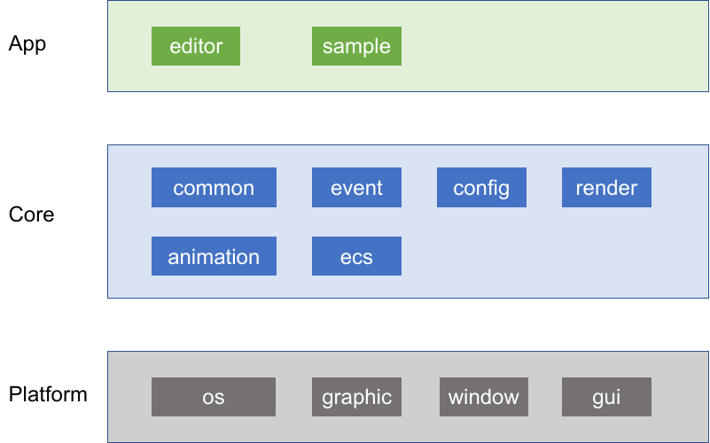

# adiosy_engine

#### Description
A simple implementation of Vulkan rendering framework.
- Homepage：[Learn_Vulkan02_渲染框架实现_开篇](http://www.adiosy.com/posts/learn_vulkan/learn_vulkan02_%E6%B8%B2%E6%9F%93%E6%A1%86%E6%9E%B6%E5%AE%9E%E7%8E%B0_%E5%BC%80%E7%AF%87.html)
- Video：[XINGCHEN0085的个人空间-哔哩哔哩](https://b23.tv/ObMaagI)

#### Feature list
- support Windows, Macos and Linux PC platforms.
- Vulkan basic rendering, include: points, lines, faces, and 3d objects.
- picking (clicking on stuff).
- texture and material rendering.
- phong lighting, normal mapping、skybox.
- simple shadows.
- ECS system, scene saving and loading.
- support obj and glTF model import.
- skin animation.
- simple scene editor.

##### TODO list:
- PBR、HDR、bloom、postprocessing and so on.
- added for Android platform.
- …

#### Software Architecture

- Platform, provide different implementation of different platforms, including the implementation of Windows, Macos and Linux PC platforms; In addition to the graphics API (OpenGL, Vulkan...) provides upper-level window system and Gui support.
- Core, which includes several modules for common tools, event, configuration and rendering, animation, and scene management.
- Application, simple implementation of a scene editor, and the use of sample, sandbox and so on.

#### Installation

```shell
mkdir build
cd build
cmake ..
make -j3
```

#### Contribution

1.  Fork the repository
2.  Create Feat_xxx branch
3.  Commit your code
4.  Create Pull Request
