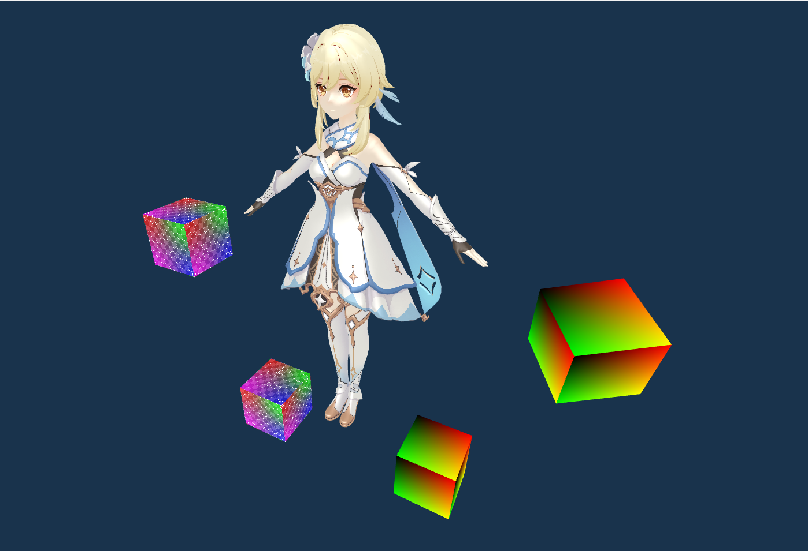
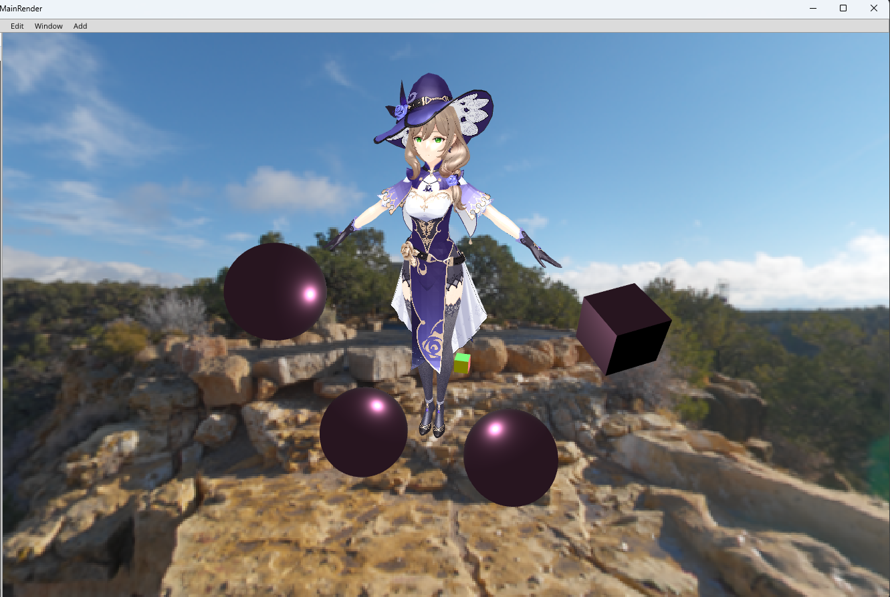

# AMEngine

AMengine is a game engine made by vulkan api for learning and is majored in physics and rendering. 

#### Installation

```shell
mkdir build
cd build
cmake ..
make -j3
```

0908: 

- update assimp importer
- support multi texture model

0915
  
- support phong pbr material
- support imgui
- enhanced code scalability

0922

- skybox
- fix bug

0925

- adjust part ui to show for adjust properties

todo:
- shadow
- postprocess bloom 
- deferred pipeline
- adjust ui
- physics 
- more graphic things


  

